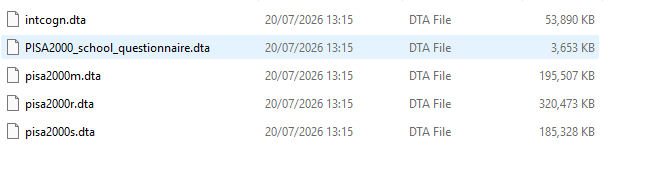

## Article

We will be reproducing the Jung-Sook Lee (2014) The Relationship Between Student Engagement and Academic Performance: Is It a Myth or Reality?, The Journal of Educational Research, 107:3, 177-185, DOI: [10.1080/00220671.2013.807491](https://www.tandfonline.com/action/showCitFormats?doi=10.1080/00220671.2013.807491).

## Data access

The article uses the U.S. data from Program for International Student Assessment 2000 (PISA 2000). PISA data is open access and can be downloaded after providing researcher information at the [PISA website](https://webfs.oecd.org/pisa2022/index.html).

An unfortunate issues with the PISA data from the year 2000 is that the data files (.txt) require SAS or SPSS scripts to match up the data (numeric and text responses) and metadata (variable and value labels). This does not work well when using other software. Luckily, there exists a package which performs this matching in Stata. This includes already prepared Stata .dta files with the data present. For simplicity's sake, we recommend downloading the PISA 2000 .dta file directly from the authors of that package: <https://www.evidin.pl/en/data/>


The order of operations is to:

(1) Register your information and the project description at the [PISA website](https://webfs.oecd.org/pisa2022/index.html).

(2) Download the PISA 2000 data from https://www.evidin.pl/en/data/ and place into a data folder (called \_data in this repository).

(3) Extract the files from the .zip file

(4) Load the .dta files into R using the [haven](https://cran.r-project.org/web/packages/haven/index.html) package from CRAN.

Your data folder should look like this:



Next, use haven to read each file into your R session.

```{r}
#| eval: false
#| include: true


install.packages("haven")

intcogn <- haven::read_dta(file.path("_data", "intcogn.dta"))
school <- haven::read_dta(file.path("_data", "PISA2000_school_questionnaire.dta"))
m <- haven::read_dta(file.path("_data", "pisa2000m.dta"))
r <- haven::read_dta(file.path("_data", "pisa2000r.dta"))
s <- haven::read_dta(file.path("_data", "pisa2000s.dta"))
```


The data are now ready to use!


## References

We would like to acknowledge the work to put the PISA 2000 data into a Stata format with the following references:

Maciej Jakubowski & Artur Pokropek, 2013. „PISATOOLS: Stata module to facilitate analysis of the data from the PISA OECD study”, Statistical Software Components, Boston College Department of Economics.

Jakubowski, M., & Pokropek, A. (2019). piaactools: A program for data analysis with PIAAC data. The Stata Journal, 19(1), 112–128. https://doi.org/10.1177/1536867X19830909

